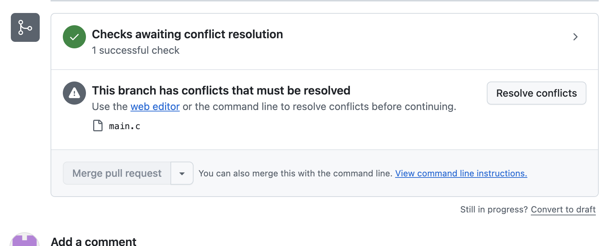
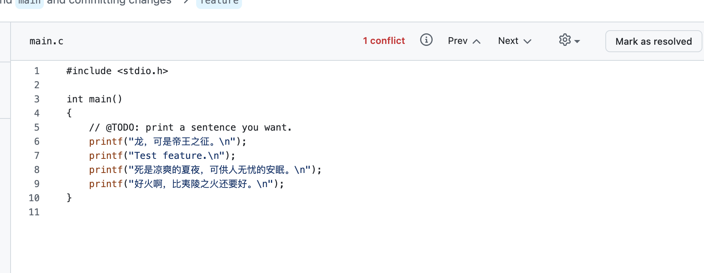
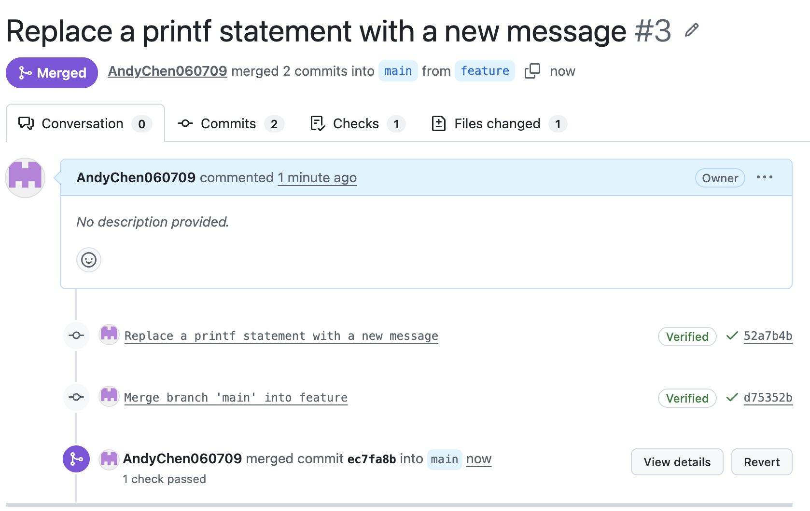

# Lab0：Git 与 GitHub 实验报告

姓名：陈彦亨　学号：25800190032  
实验日期：2026 年 9 月 21 日  
实验仓库：[AndyChen060709/TestLab](https://github.com/AndyChen060709/TestLab)

## 一、文档问题回答

**1. 多人协同开发经历**

我曾与同伴一起尝试搭建量化模型。我主要负责因子特征工程和回测引擎，策略模型则由大家共同搭建。我们按功能模块分工，在策略模型部分共同讨论和开发。这段经历让我认识到，模块之间需要配合，代码修改也需要有清晰的记录。

**2. Git 为什么设计“暂存—提交”两个步骤？**

暂存区让开发者先选择本次提交的内容，再将它保存为一个版本。工作目录里可能同时有多个任务的修改，通过 `git add` 可以把相关改动组织起来，再用 `git commit` 形成目的明确的提交，便于检查、追踪和回退。暂存后继续编辑的内容，需要再次 `git add` 才会进入下一次提交。[Git 官方说明](https://git-scm.com/book/zh/v2/Git-基础-记录每次更新到仓库)

**3. `git branch` 与 `git branch -a` 的区别**

`git branch` 列出本地分支；`git branch -a` 同时列出本地分支和远程跟踪分支，例如 `remotes/origin/main`。远程跟踪分支是本地保存的远端状态，`-a` 不会自动联网更新，需要先用 `git fetch` 获取最新信息。[Git 官方说明](https://git-scm.com/docs/git-branch)

## 二、实验步骤

### 1. 建立仓库并完成 TODO

使用课程 [GitLab 模板](https://github.com/ICS-26Fall-FDU/GitLab)建立个人仓库 `TestLab`，在 `main.c` 的 TODO 下增加：

```c
printf("龙，可是帝王之征。\n");
```

提交说明为 `Test Commit`，提交编号为 [`2a39099`](https://github.com/AndyChen060709/TestLab/commit/2a39099ca8ccaa20a594b4134a04eedfff6b177a)。随后创建 `feature` 分支，添加 `Test feature.` 输出，并通过 PR #1 完成了一次分支合并练习。

### 2. 制造合并冲突

之后，将原来的 `Hello, world!` 改为 `是啊，吃什么。`，再从这一共同版本出发，在两个分支上分别修改同一行并提交：

| 分支 | 新输出内容 | 提交编号 |
| --- | --- | --- |
| `feature` | 死是凉爽的夏夜，可供人无忧的安眠。 | `52a7b4b` |
| `main` | 好火啊，比夷陵之火还要好。 | `de33c7e` |

创建由 `feature` 合入 `main` 的 PR #3 后，GitHub 提示 `main.c` 存在冲突。原因是两个分支对共同版本的同一行做出了不同修改，Git 无法自动确定应保留哪一方。



### 3. 解决冲突并完成合并

点击 `Resolve conflicts`，在网页编辑器中整理冲突区域，保留两个分支的输出语句并删除冲突标记。下图是整理后的代码，此时尚待点击 `Mark as resolved`。



标记解决并提交后，生成 `d75352b`（`Merge branch 'main' into feature`）。随后合并 PR #3，生成 `ec7fa8b`，最终两项修改均进入 `main`。



本次使用 GitHub 网页完成冲突处理，实际是先将 `main` 合入 `feature` 解决冲突，再通过 PR 合入 `main`，没有在本地执行题目所述的 `git merge feature`。完整记录见 [PR #3](https://github.com/AndyChen060709/TestLab/pull/3)。

最终程序保留四条输出。报告整理阶段对代码副本补充执行了 `make`、`./main` 和 `make clean`，编译运行成功，输出为：

```text
龙，可是帝王之征。
Test feature.
死是凉爽的夏夜，可供人无忧的安眠。
好火啊，比夷陵之火还要好。
```

## 三、选读资料与体会

**《Commit message 和 Change log 编写指南》**介绍了结构化提交说明，用类型、范围和简短描述表达修改目的，必要时补充正文。规范的说明便于查看历史、定位改动和生成更新日志。结合本次实验，`Test Commit` 过于笼统，以后应写明具体修改内容，例如 `feat: add custom output to main.c`。[原文](https://www.ruanyifeng.com/blog/2016/01/commit_message_change_log.html)

**《语义化版本 2.0.0》**规定版本号采用“主版本号.次版本号.修订号”：不兼容的公共 API 变更增加主版本号，兼容的新功能增加次版本号，兼容的错误修复增加修订号。我理解，Git 提交记录开发过程，语义化版本则表达发布版本的兼容性，两者可以通过标签关联起来。[原文](https://semver.org/lang/zh-CN/)

**为什么要学习 Git？** Git 能记录和比较代码版本、追踪问题来源，也能通过分支支持并行开发。本次实验让我理解，冲突并不代表代码丢失，而是需要开发者判断如何整合不同修改。对于之前参与的量化模型项目，Git 可以帮助管理因子处理、回测引擎和策略模型的修改，让协作过程更清晰、可追溯。
